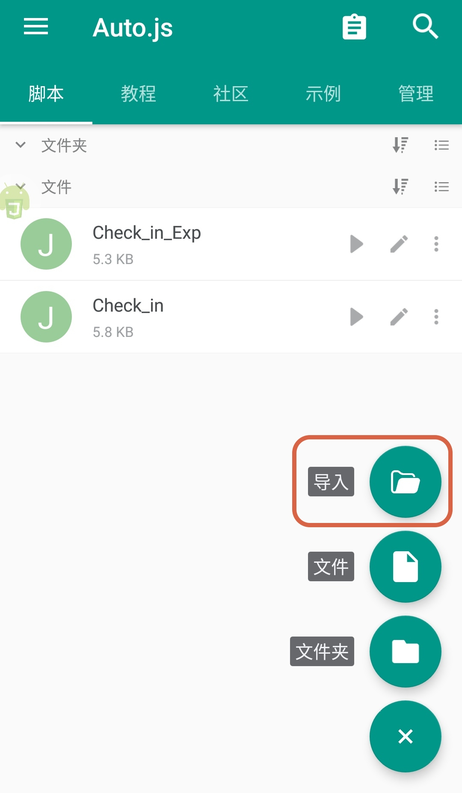
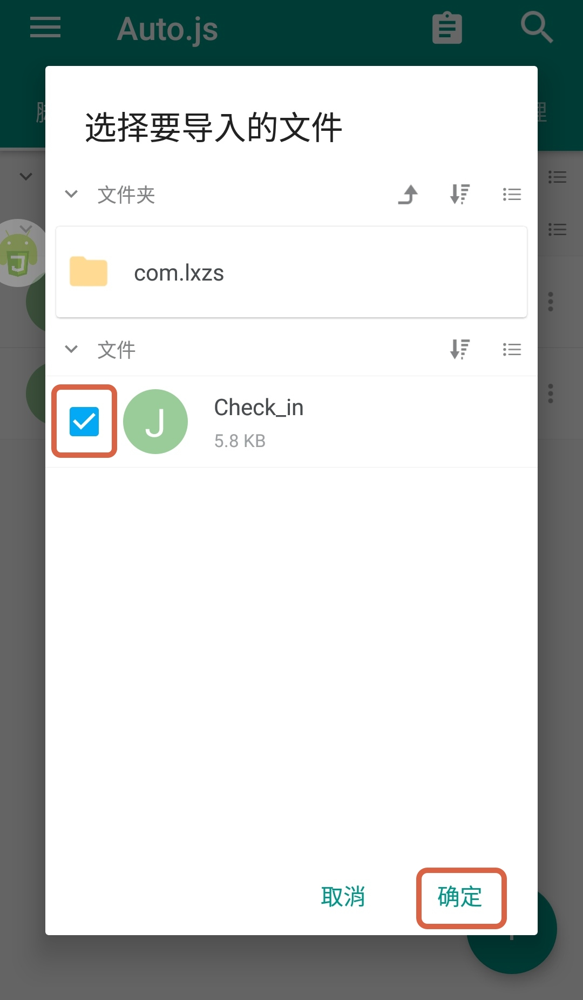
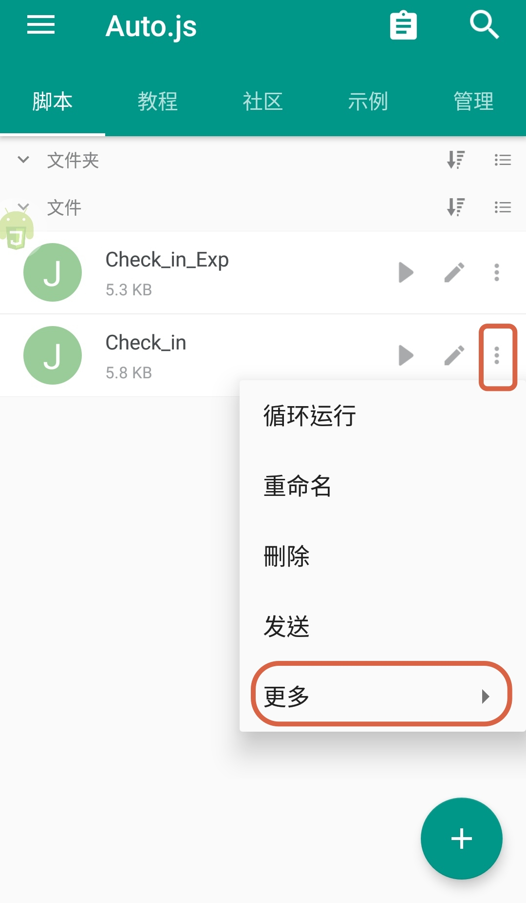
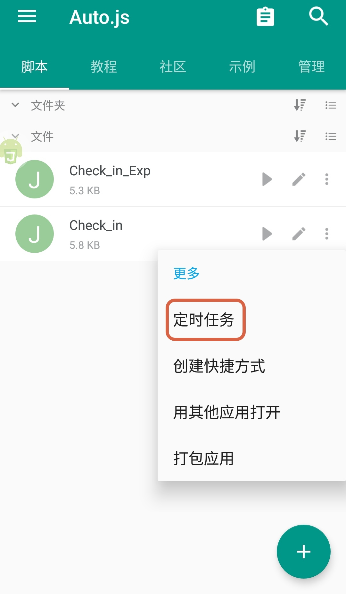
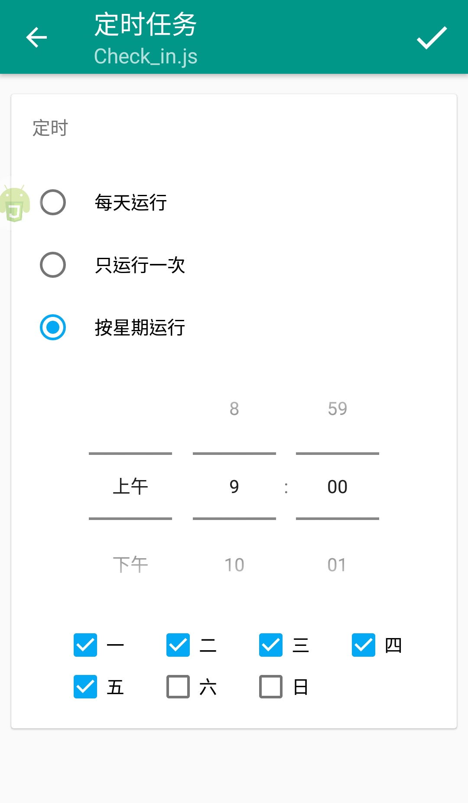
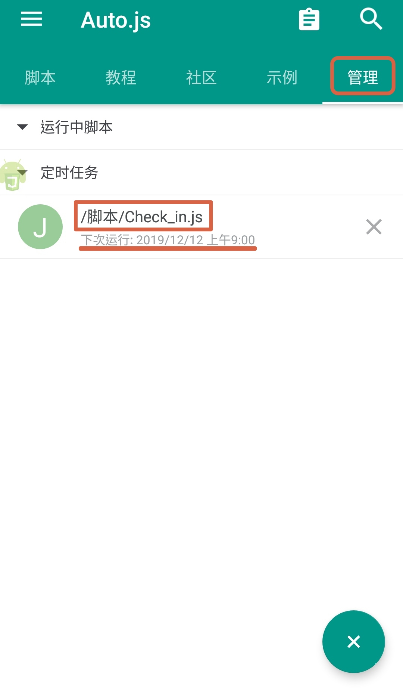

# DingTalk_Auto_Check_In
Android mobile設備 使用 Auto.js 實現釘釘自動打卡

## 關於Auto.js
不需要Root權限的JavaScript自動化軟體  
詳細參照<a href="https://hyb1996.github.io/AutoJs-Docs/" target="_blank">官方網站</a>  
<a href="https://github.com/hyb1996/Auto.js/issues/500#issuecomment-521103649" target="_blank">作者已下架官方apk載點</a>，有需要的人請網上自行搜尋  
另外建議使用v4.1.1版(可開啟維持前台服務)  

## 使用情境
將備用機(or 舊機)，接上充電線置於公司，執行腳本後放置play，每天自動打卡  
若公司網路沒有阻擋遠端連線，建議直接使用TeamView手機版  

## 使用說明
[注意] 將手機螢幕關閉自動的時間設定為7分鐘以上(詳細原因見<a href=#後記>後記</a>)  
1.將 Chenk_in.js 存到手機裡  
2.打開app點即右下角的＋，點擊導入  
3.依照存放的路徑找到檔案，勾選腳本匯入  

  
4.回到主頁，點擊腳本右側的選項鈕，點選清單更多的選項  
5.選擇建立定時任務  

  
6.依照需求設定執行時間  
7.建立完成後，切換到管理頁籤可看到建立的定時任務  

  

## 使用限制
使用限制上就如官方文件所寫 需要Android 7.0或以上、需要無障礙功能 等等  
值得一提的是，要注意你的手機有無 "自動啟動管理、電池效能最佳化、螢幕關閉時清理後台程式" 等等之類的功能  
記得全部要把對 Auto.js 的限制調掉，以確保腳本可以正確執行到最後  
1. 自動啟動管理 → 允許 Auto.js 可自動啟動
2. 電池最佳化 → 對於 Auto.js 不要最佳化
3. 螢幕關閉時清理後台程式 → 關閉此功能
4. Android手機品牌繁多，有許多同功不同名的設定，只提我知道的，其餘請自行研究

關於電池效能要調整成不要最佳化的原因是，  
若將電池最佳化開啟，長時間不進行任何動作的app有可能會被進入閒置狀態，  
導致即使時間到了，腳本也不執行任何動作，很是尷尬。  

## 目前已知issues
只支持滑動解鎖的手機，若手機有設定圖型、指紋、臉部解鎖等等，都無法運作  
故只建議使用無任何重要資料的備用機(or 舊機)  

## 後記
原先腳本的定時執行是自己寫 while迴圈 + if 判斷執行時間到了沒，  
但後來發現不知道是Auto.js 有bug，還是手機的控制系統本身就有限制，  
如果執行sleep期間 如果手機螢幕關閉，在時間計算上會慢非常多  
官方討論版也有人討論<a href="https://www.autojs.org/topic/197/%E4%BD%BF%E7%94%A8sleep-%E5%9C%A8%E9%94%81%E5%B1%8F%E4%B9%8B%E5%90%8E-%E4%B8%8D%E5%87%86" target="_blank">此問題</a>  
不過我測試是就算螢幕不關，執行5分鐘以上的sleep，手機有時候也會不醒人事...Orz  
後來才發現Auto.js 本身就有提供定時執行，改用Auto.js 的定時執行就OK了，  
目前在abandoned資料夾內的腳本就是摒棄的版本
